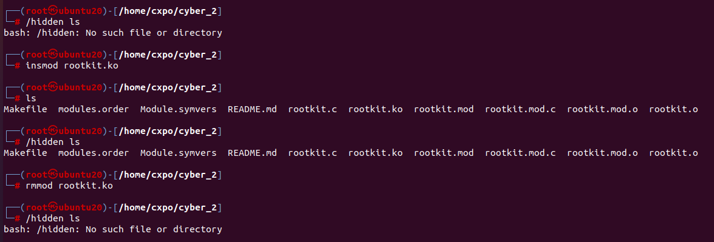

# CyberSecurity Task : 2
# Rootkit Development

## Environment
__Kernel Version__ : 5.15.0-67-generic

__OS__ : Ubuntu 20.04.6

__Hyperviser__ : Oracle VM VirtualBox 

## Task Completion Status 
- I succesfully intercepted `execve` syscall, identified commands prefxied with `/hidden` and able to run the modified command.
- I didn't suppress the logging.

## Working
### 1. **Accessing `sys_call_table`**:
- To hook the `execve` call we need to access `sys_call_table` which stores pointers of all syscalls.
- `kallsyms` contains all symbols for kernel functions and tables.
- There is function called `kallsyms_lookup_name` which takes symbol name as argument and returns address of symbol.

### 2. **Using `kprobes` for Kernel Versions > 5.7**:
- In kernel versions > 5.7 `kallsyms_lookup_name` is not exported. To overcome this I used `kprobes` [[Reference](https://github.com/xcellerator/linux_kernel_hacking/issues/3#issuecomment-757994563)]
- To get `kallsyms_lookup_name` address, `kprobe` is placed and address is fetched.
- Similarly `sys_call_table` address can be found using `kallsyms_lookup_name` function.
- To intercept `execve` syscall, we have to overwrite `execve` pointer in `sys_call_table`

### 3. **Disabling and Enabling Write Protection**:
- In x86 architecture, 16th bit of `cr0` register decides Write Protection. If it is 1, protection is enabled. 
- In default, it is 1. To disable protection we have to flip bit. Due to certain restrictions in kernel, we have to do it in assembly.
- To disable protection
```
new_cr0 = orginal_cr0 & ~0x00010000
``` 
- To enable protection
```
new_cr0 = orginal_cr0 | 0x00010000
```

>__Note__ : `0x00010000` is hexadecimal equivalent of 2^16


### 4. **Intercepting the `execve` System Call**:
- Function prototype is created for `execve` syscall and call is hooked by replacing original pointer with modified `execve` pointer.
- Filename and Arguments are obtained from registers by looking at [syscall reference table](https://hackeradam.com/x86-64-linux-syscalls/) 

> __Note__ : This rootkit works for programs available in `/usr/bin`. I cannot find path for each program. I also tried using `kmod_path_lookup` the fucntion used to find path of program. Because of NX (Non Executable) protection on memory, I cannot find the path.

- Commands prefixed with `/hidden` is identified ,Filename and Arguments are modified accordingly.

### 5. **Module Unloading**:
- Unloading module rollbacks original `execve` syscall.




.


